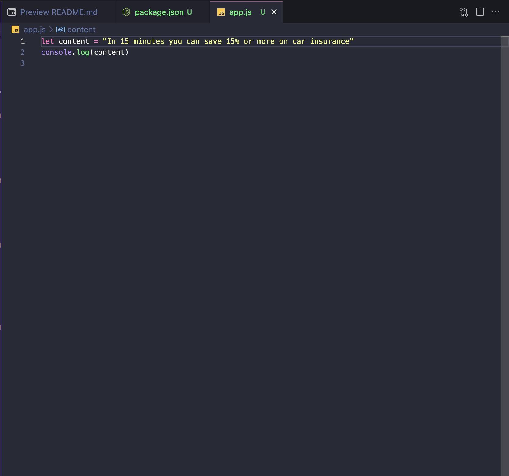
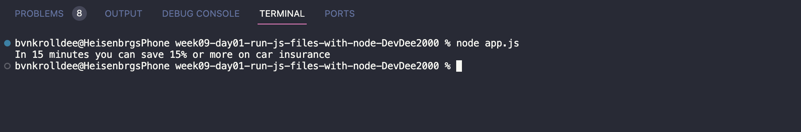

# Run a JS file with Node

## Your First Server

In this Lab, you're going to be creating your first server using Node.js! Your server will be the starting point for building powerful web applications.

### Prerequisites

Before you begin, make sure you have the following done:

- Installed [Node.js](https://nodejs.org/)
- Followed the link to Github Classrooms and got your repository.
- Pulled down your repository

### Part 1: Setting Up the Project with `npm init`

#### Assignment:

- **Task:** Create a new Node.js project using `npm init`.
- **Requirements:**
  1. Provide a unique project name.
  2. Set the version to "1.0.0".
  3. Specify a main entry point (e.g., "index.js").
  4. Include a simple "start" script in `package.json`.
- **Verification:**
  - Verify that your project has a package.json

---

### Part 2: Understanding the `package.json` on a Server

#### Assignment:

- **Task:** Modify the project from Part 1 to include a server script.
- **Requirements:**
  1. Create a simple server script (e.g., "server.js").
  2. Configure the "start" script in `package.json` to run the server script.
- **Verification:**
  - You should be able to run your script in your cmd.

---

### Part 3: Running a JS File with Node

#### Assignment:

- **Task:** Create a new JavaScript file and run it using Node.js.
- **Requirements:**
  1. Create a JavaScript file (e.g., "app.js") with simple code (e.g., print a message).
  2. Use the `node` command to run the JavaScript file.
  3. Experiment with command-line arguments (if applicable).
- **Verification:**
  - Your program should perform some functionality when ran from the terminal.

## Submission

For this Lab to be submitted you should submit the link to your repository.
Verify that all Task are complete.

Happy coding! 