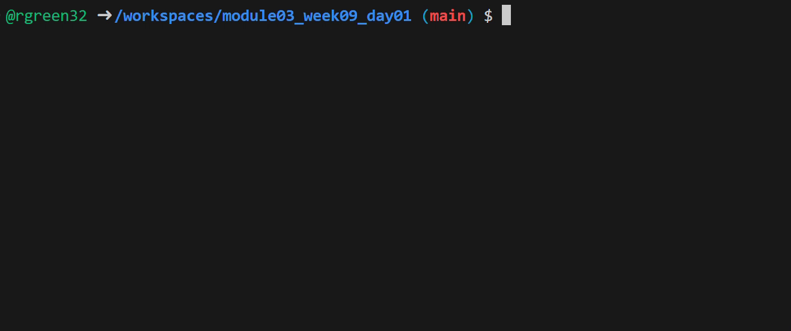
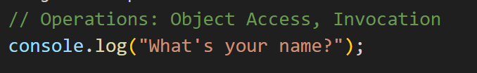

# Node.js Beginner Assignment: Basic Input and Output

## Assignment: Create a Simple Node.js Application

In this assignment, you will create a simple Node.js application that accepts input from the user and displays a response in the console. This project introduces the basics of Node.js, including working with JavaScript in a server environment and using `process` for input/output.


### Part 1: Create the javscript file

1. Create a new file called `main.js` in this folder

2. Copy this code into `main.js`:
   -  ```javascript
      // Operations: Object Access, Invocation
      console.log("What's your name?");

      // Operations:
      process.stdin.on('data', function(data) {

          // Operations:
          const name = data.toString().trim();
          
          // Operations:
          console.log(`Hello, ${name}!`);

      });
      ```


### Part 2: Use Node to run the javascript file

1. In your terminal, navigate to the project directory.
2. Run your application using Node.js:
    ```bash
    node main.js
    ```

3. Test your application by typing in a name when prompted and checking if the greeting message is displayed correctly.

---

### Part 3: Add a comment above each line that states the operations performed



